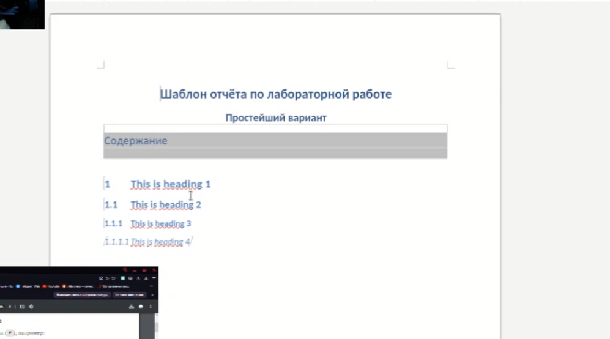
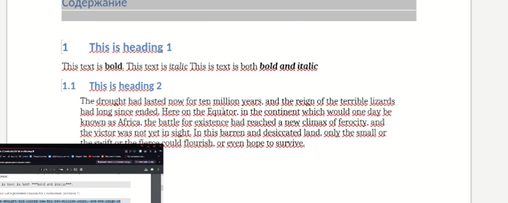
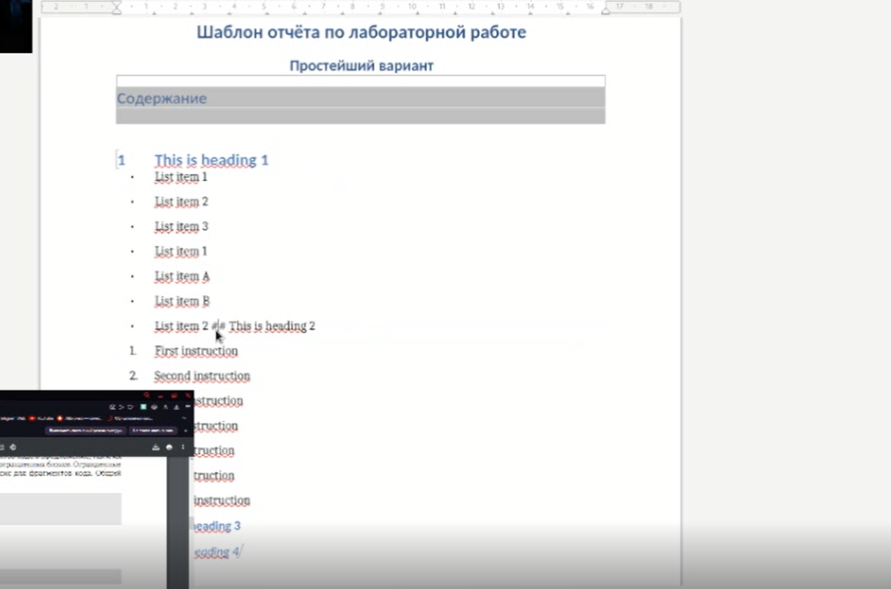
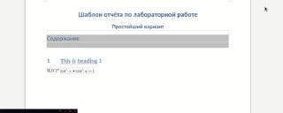

---
## Front matter
lang: ru-RU
title: отчёт по лабораторной работе №3 презентации
author:
  - Архипов Ф А
institute:
  - Российский университет дружбы народов, Москва, Россия

## i18n babel
babel-lang: russian
babel-otherlangs: english

## Formatting pdf
toc: false
toc-title: Содержание
slide_level: 2
aspectratio: 169
section-titles: true
theme: metropolis
header-includes:
 - \metroset{progressbar=frametitle,sectionpage=progressbar,numbering=fraction}
 - '\makeatletter'
 - '\beamer@ignorenonframefalse'
 - '\makeatother'
---

# Информация

## Докладчик

:::::::::::::: {.columns align=center}
::: {.column width="70%"}

  * Архипов Ф А
  * студент
  * Российский университет дружбы народов

:::
::: {.column width="30%"}

:::
::::::::::::::

# Вводная часть

## Объект и предмет исследования

- язык разметки МД

## Цели и задачи

- повторно изучить язык разметки Markdown

# язык Markdown создание заголовка 
Чтобы создать заголовок, используйте знак ( # ), например: 

{#fig:001 width=70%}

# язык Markdown цитирование, полужирный, жирный  
тобы задать для текста полужирное начертание, заключите его в двойные звездочки:

Чтобы задать для текста курсивное начертание, заключите его в одинарные звездочки:

Чтобы задать для текста полужирное и курсивное начертание, заключите его в тройные
звездочки:

Блоки цитирования создаются с помощью символа >:

{#fig:001 width=70%}
{#fig:001 width=70%}

# язык Markdown формулы
Внутритекстовые формулы делаются аналогично формулам LaTeX. Например, формула
sin2(x) + cos2(x) = 1

{#fig:001 width=70%}

